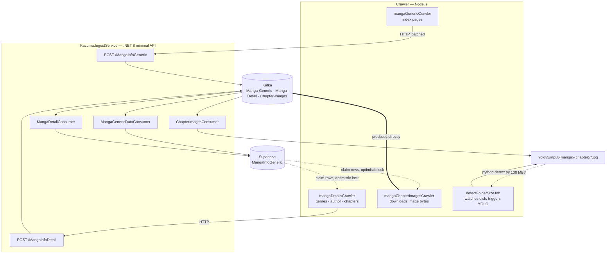

<h1 align="center">Kazuma</h1>

<p align="center">
  <em>A distributed manga scraping &amp; image-ingestion pipeline.</em><br/>
  Node.js crawlers · Kafka streaming · .NET 8 ingest service · Supabase · YOLOv5
</p>

<p align="center">
  
  
  
  
  
</p>

---

## Overview

Kazuma scrapes a manga catalogue, stores its metadata in Postgres, and streams
every chapter image through Kafka into a YOLOv5 anime-face-detection model.

The design target is throughput: roughly **336,000 chapters × 20 images in 10
hours** — about 672,000 images per hour. That number drives most of the
architecture. Metadata is small, so it travels over HTTP into a Kafka topic;
image bytes skip HTTP entirely and are produced straight to the broker, because
an HTTP round trip per image does not survive that rate.


## How it works



Metadata is discovered in three widening stages, each feeding the next through a
single Supabase table that doubles as the work queue:

| Stage | Crawler | Produces | Lands in |
|:--|:--|:--|:--|
| **1 · Generic** | `mangaGenericCrawler` | `{id, title}` for every title in the catalogue | new rows |
| **2 · Detail** | `mangaDetailsCrawler` | thumbnail, author, genres, chapter list | same rows, enriched |
| **3 · Images** | `mangaChapterImagesCrawler` | every image of every chapter | Kafka → disk → YOLOv5 |

## Highlights

<table>
<tr><td width="50%" valign="top">

**A generic Kafka consumer framework**

`Kazuma.Common` provides a reusable consumer layer over `Confluent.Kafka`.
Registration is convention-based — subclass `TopicConsumer<TKey, TValue>`, pass a
topic name to the base constructor, and reflection wires it up with no extra
configuration.

Included out of the box: a bounded local buffer (10,000 messages) so a large
backlog can't OOM the host, manual offset commits, per-message and batch
processing modes, and a dead-letter consumer that re-produces failures with
`retry_times` / `retry_error` / `retry_at` stamped in.

</td><td width="50%" valign="top">

**Optimistic locking without `FOR UPDATE`**

Multiple crawler workers race for the same rows, but Supabase's REST API offers
no row-level locking. Kazuma pushes the conflict check into Postgres instead:

```sql
CREATE FUNCTION check_update() RETURNS TRIGGER AS $$
BEGIN
  IF NEW."Lock" != OLD."Lock" THEN RETURN NEW;
  ELSE RAISE EXCEPTION 'New data is the same as old data!';
  END IF;
END; $$ LANGUAGE plpgsql;
```

Workers select unlocked rows and upsert with `Lock` flipped. The loser's update
doesn't change `Lock`, the trigger raises, the upsert fails, and that worker
backs off 2–5 s and retries.

</td></tr>
</table>

## Project layout

```
Kazuma/
├── Crawler/                              # Node.js — the scrapers (ESM)
│   ├── Job.js                            #   entry point: starts the cron jobs
│   ├── Jobs/                              #   node-cron schedules + YOLO trigger
│   ├── CrawlerService/                   #   the three crawl stages
│   ├── Kafka/KafkaProducer.js            #   kafka-node producer
│   ├── SystemService/folderService.js    #   recursive dir size + image count
│   └── src/supabase/                     #   client, queries, lock trigger
│
├── api/Kazuma/                           # .NET 8
│   ├── Kazuma.Common/                    #   Kafka framework, config, models
│   ├── Kazuma.Core/                      #   DI extensions, Redis cache, utilities
│   └── Kazuma.IngestService/             #   the host: endpoints + 3 consumers
│
├── docker-compose/                       # Zookeeper + single-broker Kafka
└── socket-client/                        # realtime notifications (planned)
```

## Getting started

### Prerequisites

- Node.js ≥ 18 and Yarn
- .NET 8 SDK
- Docker Desktop
- A Supabase project
- *Optional:* a YOLOv5 checkout with `yolov5s_anime.pt` weights, and Redis on `:6379`

### 1 · Database

Create a `MangaInfoGeneric` table:

| Column | Type | Purpose |
|:--|:--|:--|
| `id` | `text` **PK** | `bl-<siteId>`, e.g. `bl-33544` |
| `title` | `text` | URL slug, e.g. `gannibal` |
| `createdAt` / `updatedAt` | `timestamp` | ordering keys for oldest-first claiming |
| `thumbnail`, `author`, `genre`, `list_chapter` | `text` | pipe-delimited scraped detail |
| `current_chapter` | `text` | chapter count |
| `processed` | `bool` | detail stage complete |
| `Lock` | `text` | optimistic-lock flag (`"true"` / `"false"`) |

Then apply the trigger in `Crawler/src/supabase/Trigger/checkValueChange.sql`.

### 2 · Kafka

```bash
cd docker-compose/kafka-stack-docker-compose
docker compose -f zk-single-kafka-single.yml up -d
```

Broker on `localhost:9092` · 3 partitions per topic · topic auto-create · 1-hour
retention · `KAFKA_MESSAGE_MAX_BYTES = 30000000`, since chapter images travel as
base64 inside the message value.

### 3 · Ingest service

<details>
<summary><strong>Generate the .NET project files</strong> — the <code>.csproj</code>/<code>.sln</code> are not tracked in this repo</summary>

```powershell
cd api/Kazuma

dotnet new classlib -n Kazuma.Common        -o Kazuma.Common        --force
dotnet new classlib -n Kazuma.Core          -o Kazuma.Core          --force
dotnet new web      -n Kazuma.IngestService -o Kazuma.IngestService --force
Remove-Item Kazuma.Common/Class1.cs, Kazuma.Core/Class1.cs -ErrorAction SilentlyContinue

dotnet new sln -n Kazuma
dotnet sln add Kazuma.Common/Kazuma.Common.csproj `
               Kazuma.Core/Kazuma.Core.csproj `
               Kazuma.IngestService/Kazuma.IngestService.csproj

dotnet add Kazuma.Core/Kazuma.Core.csproj                   reference Kazuma.Common/Kazuma.Common.csproj
dotnet add Kazuma.IngestService/Kazuma.IngestService.csproj  reference Kazuma.Common/Kazuma.Common.csproj
dotnet add Kazuma.IngestService/Kazuma.IngestService.csproj  reference Kazuma.Core/Kazuma.Core.csproj

# packages
dotnet add Kazuma.Common        -p Confluent.Kafka
dotnet add Kazuma.Common        -p Newtonsoft.Json
dotnet add Kazuma.Common        -p Supabase
dotnet add Kazuma.Common        -p Microsoft.Extensions.Hosting.Abstractions
dotnet add Kazuma.Common        -p Microsoft.Extensions.Options
dotnet add Kazuma.Common        -p Microsoft.Extensions.Logging.Abstractions
dotnet add Kazuma.Core          -p StackExchange.Redis
dotnet add Kazuma.Core          -p Microsoft.Extensions.Caching.StackExchangeRedis
dotnet add Kazuma.Core          -p Newtonsoft.Json
dotnet add Kazuma.IngestService -p SixLabors.ImageSharp
dotnet add Kazuma.IngestService -p Swashbuckle.AspNetCore
```

One fix is needed afterwards: `Kazuma.Common/Kafka/KafkaProducer.cs` imports
`Kazuma.Core.Utilities.Kafka.KafkaUtility` while `Kazuma.Core` references
`Kazuma.Common`, which is circular. Both projects ship an identical
`KafkaUtility` — repoint that `using` at `Kazuma.Common.Utilities.Kafka`.

</details>

Add the configuration sections to `Kazuma.IngestService/appsettings.json`:

```json
{
  "KafkaProducerConfiguration": {
    "BootstrapServers": "localhost:9092",
    "MessageMaxBytes": 30000000
  },
  "KafkaConsumerConfiguration": {
    "BootstrapServers": "localhost:9092",
    "GroupId": "kazuma-ingest",
    "AutoOffsetReset": "Earliest",
    "EnableAutoCommit": false,
    "FetchMaxBytes": 30000000
  },
  "SupabaseConfig": {
    "SupabaseUrl": "https://<your-project>.supabase.co",
    "SupabaseKey": "<your-anon-key>"
  }
}
```

Run it on port **5197** — the port the crawlers post to:

```bash
cd api/Kazuma/Kazuma.IngestService
dotnet run --urls http://localhost:5197
```

Swagger UI: <http://localhost:5197/swagger>. Start Kafka first — the producer
queries broker metadata during startup and will block until it answers.

### 4 · Crawlers

```bash
cd Crawler
yarn install
```

```bash
# Stage 1 — index pages → POST /MangaInfoGeneric
node -e "import('./CrawlerService/mangaGenericCrawler.js').then(m => m.mangaGenericCrawler())"

# Stage 2 — detail pages → POST /MangaInfoDetail
node -e "import('./CrawlerService/mangaDetailsCrawler.js').then(m => m.mangaDetailsCrawler())"

# Stage 3 — chapter images → Kafka
node ./CrawlerService/mangaChapterImagesCrawler.js

# YOLOv5 watcher — polls every 15 s, runs detect.py past 100 MB
node ./Jobs/directoryJob.js
```

Or let cron drive everything through `Job.js`:

```js
import { mangaGenericCrawlerJob, mangaDetailsCrawlerJob, mangaChapterImagesCrawlerJob } from "./Jobs/MangaJobs.js"

mangaGenericCrawlerJob.start()        // */5 * * * * *   every 5 s
mangaDetailsCrawlerJob.start()        // 1 0 * * *       daily 00:01
mangaChapterImagesCrawlerJob.start()  // 1 0 * * *       daily 00:01
```

## Example

Push a metadata batch by hand and watch it flow end to end:

```bash
curl -X POST http://localhost:5197/MangaInfoGeneric \
  -H "Content-Type: application/json" \
  -d '[
        { "id": "bl-33544", "title": "kimi-wa-nina-janai-33544" },
        { "id": "bl-26564", "title": "gannibal" }
      ]'
```

```
POST /MangaInfoGeneric
  └─ KafkaProducer.ProduceAsync("Manga-Generic", payload)     JSON → UTF-8 bytes
       └─ topic Manga-Generic
            └─ MangaGenericDataConsumer                        "Processing at: <ts>"
                 └─ de-dupe by id → Supabase upsert            2 rows written
```

`Crawler/CrawlData/GenericData/data.json` holds ~100 real records in this exact
shape for a larger test batch.

Chapter images move as a separate message shape, produced by
`mangaChapterImagesCrawler.js` and consumed by `ChapterImagesConsumer`:

```json
{
  "mangaName": "gannibal",
  "imageByte": "<base64 jpg>",
  "fileName": "01.jpg",
  "chapterFolderName": "c123-chapter-1"
}
```

The consumer re-encodes it with ImageSharp and writes
`Yolov5/input/gannibal/c123-chapter-1/01.jpg`.

## Configuration notes

A few paths and endpoints are currently hardcoded and will need to match your
machine:

| File | Value |
|:--|:--|
| `Consumers/ChapterImagesConsumer.cs` | YOLOv5 input directory |
| `Jobs/directoryJob.js` | YOLOv5 base path, weights, `detect.py` |
| `CrawlerService/mangaGenericCrawler.js` | ingest URL, and the page range to scrape |
| `CrawlerService/mangaDetailsCrawler.js` | ingest URL |
| `Kazuma.Core/DI/Extensions/ServiceCollectionExtensions.cs` | Redis connection string |

Supabase credentials belong in `Crawler/src/supabase/supabaseClient.js`, which
already imports `dotenv` — move them to `SUPABASE_URL` / `SUPABASE_KEY` in a
`.env` file rather than committing them.

## Roadmap

- [ ] Move all crawlers to background jobs (Bull)
- [ ] Generic repository so new site crawlers are drop-in
- [ ] Update-crawler for new chapters, auto-triggering detail fill
- [ ] Worker that kicks off training once storage crosses a threshold
- [ ] Realtime progress notifications over Socket.IO (`socket-client/`)
- [ ] Source → bytecode compiler for detection results feedback

## Known limitations

- `Kazuma.Core`'s `CacheService` leaves its `ConnectionMultiplexer` unassigned,
  so the Redis-direct methods (`KeyExists`, `Lock`, `SetExpire`) are not yet
  usable; the `IDistributedCache`-backed `Get`/`Set` paths work.
- Both metadata consumers log and commit on upsert failure, so failed writes are
  not retried — the `DeadTopicConsumer` base class exists but isn't wired in.
- `POST /SaveChapterImages` is the pre-Kafka image path and is no longer called.
- YOLOv5 runs as a shelled-out `python detect.py` rather than a model server.

## License

MIT
